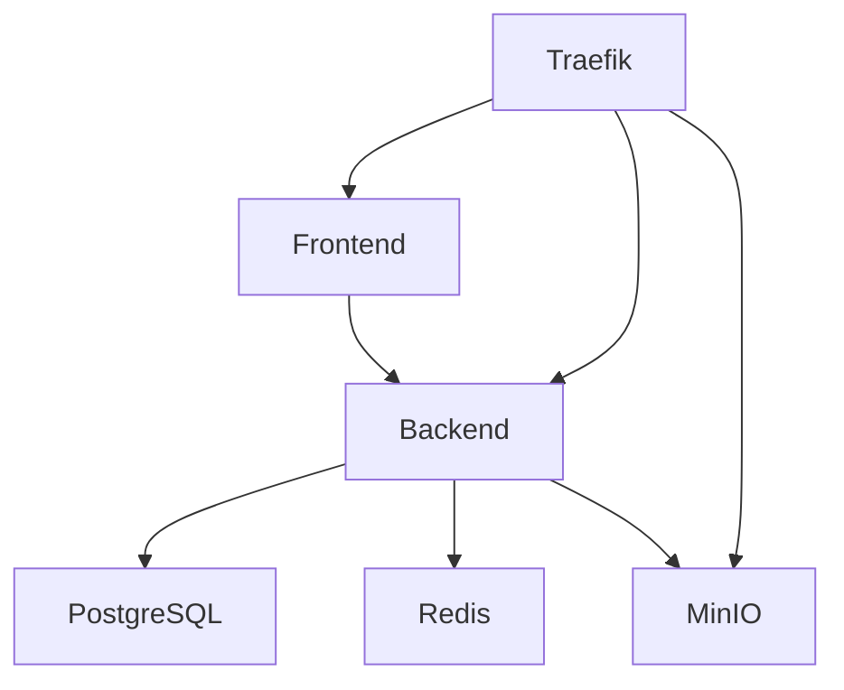

# DocuSign Dynamic Data Agreement Engine (DDAE)

A production-ready system for automatically updating DocuSign agreements based on real-time data from various sources including commodity prices, IoT sensors, and weather data.

## Features

- 🔄 Auto-updating agreements using live data
- 📬 Automatic DocuSign envelope generation on threshold breaches
- 📊 Real-time agreement health dashboards
- 🔒 Self-hosted infrastructure with Docker
- 🚀 Modern tech stack: Node.js, React, PostgreSQL, Redis, MinIO

## Quick Start

1. Clone the repository:
   ```bash
   git clone https://github.com/yourusername/ddae.git
   cd ddae
   ```

2. Set up environment variables:
   ```bash
   cp .env.example .env
   # Edit .env with your configuration
   ```

3. Start the services:
   ```bash
   docker-compose up -d
   ```

4. Access the services:
   - Frontend: https://localhost
   - API: https://api.localhost
   - MinIO Console: https://minio.localhost:9001

## Architecture

- **Frontend**: React + Vite + Socket.io for real-time updates
- **Backend**: Node.js + Express + BullMQ for job processing
- **Database**: PostgreSQL for persistent storage
- **Cache**: Redis for API data caching
- **Storage**: MinIO (S3-compatible) for document storage
- **Proxy**: Traefik with automatic SSL via Let's Encrypt

## Required Third-Party Services

1. DocuSign
   - Register at [DocuSign Developer Center](https://developers.docusign.com/)
   - Create an integration key and configure JWT authentication

2. Alpha Vantage (for market data)
   - Get API key at [Alpha Vantage](https://www.alphavantage.co/)

3. Losant (for IoT data)
   - Sign up at [Losant](https://www.losant.com/)
   - Create an application and get API credentials

4. Stripe (for payments)
   - Register at [Stripe Dashboard](https://dashboard.stripe.com/)
   - Get API keys for your environment

5. Twilio & SendGrid (for notifications)
   - Set up accounts at [Twilio](https://www.twilio.com/) and [SendGrid](https://sendgrid.com/)
   - Configure API keys and sender information

## Development

The project uses Docker Compose for local development. Each service is configured with appropriate development settings and hot-reloading where applicable.

### Service Dependencies



## Production Deployment

1. Update `.env` with production values
2. Configure SSL certificates via Let's Encrypt
3. Set up monitoring with Prometheus (optional)
4. Deploy using Docker Compose:
   ```bash
   docker-compose -f docker-compose.yml -f docker-compose.prod.yml up -d
   ```

## License

MIT 